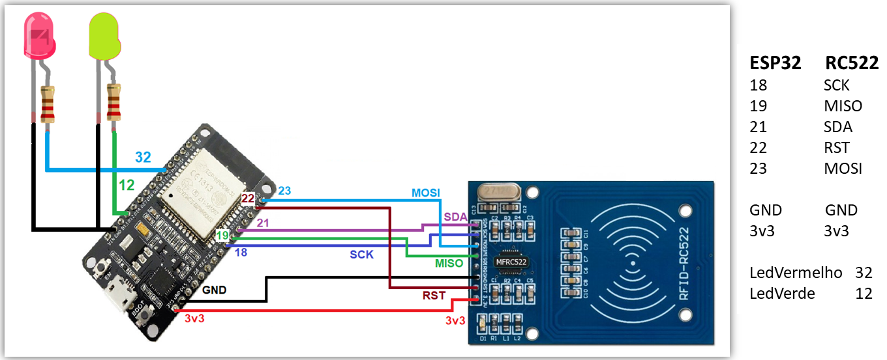

### Conteúdo da pasta

1. [mrfc32_v1.ino](mrfc32_v1.ino) - Implementação (Arduino IDE) do diagrama abaixo.

2. [MFRC522Extended.cpp ](fix-lib-mrfc32/MFRC522Extended.cpp) - Fix para a Lib do MFRC522 caso seja usado em conjunto com o ESP32.

3. [esp8266_wifi.ino](esp8266_wifi.ino) - Primeira versão com uso da Lib WiFi.h em placas ESP8266. 

Diagrama: 

### To-Dos (Hardware)
____

1. Implementação de um display LCD 16x2

2. Mergear o código [esp8266_wifi.ino](esp8266_wifi.ino) com a [mrfc32_v1.ino](mrfc32_v1.ino), permitindo que a ESP32 faça consulta a API, conforme primeira implementação

3. Tratar o devido retorno da API, de forma que o LCD 16x2 exiba apenas o nome do usuário (Se sucesso) ou outra mensagem de erro

(...)

## Aviso

Código testado na Board Freenove ESP32 WROVER.

# Cŕeditos e Referências

https://www.fernandok.com/2018/02/esp32-com-rfid-controle-de-acesso.html

https://randomnerdtutorials.com/getting-started-freenove-esp32-wrover-cam/

https://www.electronicwings.com/esp32/rfid-rc522-interfacing-with-esp32

